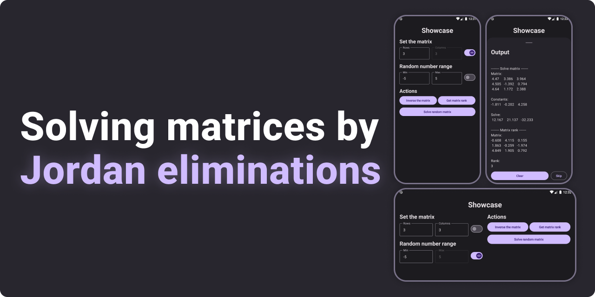
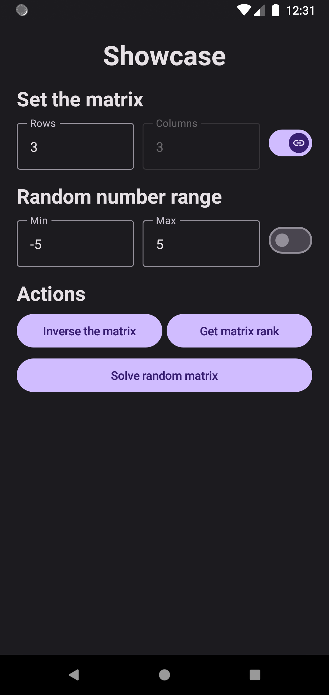

<h1 align="center">
    Jordan Matrix solution
</h1>

## Description

The application for solving matrices using the Jordan elimination method. With its help, users can easily and quickly
perform matrix operations using this efficient linear algebra method.

### Key features

- Jordan elimination for matrix solution
- Finding the rank of a matrix
- Matrix inversion

### App features

- Adaptable to both portrait and landscape modes
- Animation of gradual text display with the ability to skip
- Tests have been written to check the algorithm for the problem

### Screenshots

    <table >
     <tr>
        <td><b>Portrait</b></td>
        <td><b>Protocol</b></td>
     </tr>
     <tr>
       <td></td>
       <td></td>
     </tr>
    </table>
    
    

 
    ⭐ I hope you don't have any problems using it.

